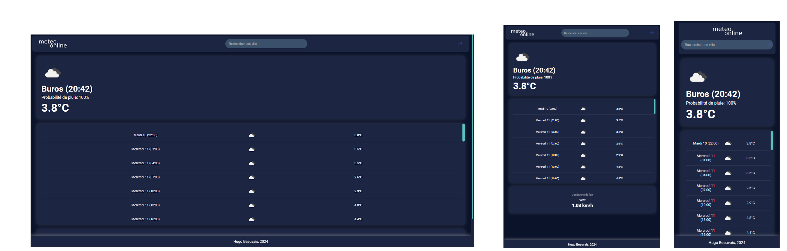

# Meteonline

## Sujet du projet
Meteonline est une application web qui permet aux utilisateurs de consulter les prévisions météorologiques pour leur emplacement actuel ou pour une ville de leur choix. L'application utilise l'API OpenWeatherMap pour récupérer les données météorologiques en temps réel.



## Fonctionnalités principales
- **Recherche par ville** : Les utilisateurs peuvent rechercher les prévisions météorologiques pour une ville spécifique en entrant le nom de la ville dans la barre de recherche.
- **Géolocalisation** : L'application peut détecter automatiquement la position actuelle de l'utilisateur et afficher les prévisions météorologiques pour cet emplacement.
- **Affichage des prévisions actuelles** : Les informations météorologiques actuelles, telles que la température, la probabilité de pluie, et la vitesse du vent, sont affichées de manière claire et concise.
- **Prévisions à court terme** : Les utilisateurs peuvent consulter les prévisions météorologiques pour les prochaines heures.
- **Conditions de l'air** : Affichage des conditions de l'air, y compris la vitesse du vent.

## Rôle du développeur
- **Hugo Beauvais** : Responsable du développement complet du projet, y compris la conception de l'interface utilisateur, l'intégration des styles CSS, l'implémentation de la géolocalisation, la gestion des événements utilisateur, l'intégration de l'API OpenWeatherMap et la gestion des requêtes de données météorologiques.

## Installation et utilisation
1. Clonez le dépôt :

    ```bash
    git clone https://github.com/hugobazl/meteonline.git
    ```

2. Remplacez la clé API dans le fichier `script/config.js` par votre propre clé API OpenWeatherMap :

    **config.js**
    ```javascript
    // Clé API OpenWeatherMap, à remplacer par votre propre clé.
    const apiKey = 'YOUR_API_KEY_HERE';
    ```

3. Ouvrez le fichier `index.html` dans votre navigateur pour accéder à l'application.

## Technologies utilisées
- HTML
- CSS
- JavaScript
- API OpenWeatherMap

## Auteur
- Hugo Beauvais